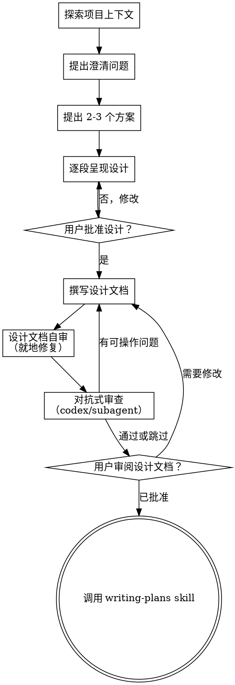

# 头脑风暴：从创意到设计

通过自然的协作对话，帮助把创意打磨成完整的设计和规格说明。

首先了解当前项目的上下文，然后逐个提问来细化创意。一旦理解了要构建的内容，呈现设计方案并获得用户批准。

<HARD-GATE>
在你呈现设计方案并获得用户批准之前，不要调用任何实现类 skill、编写任何代码、搭建任何项目骨架，或采取任何实现行动。无论项目看起来多简单，都必须遵守此规则。
</HARD-GATE>

## 反模式："这个太简单了，不需要设计"

每个项目都要走这个流程。一个 todo 列表、一个单函数工具、一个配置变更——全都要。"简单"的项目恰恰是未经审视的假设导致最多返工的地方。设计方案可以很短（对于真正简单的项目几句话就够了），但你**必须**呈现它并获得批准。

## 检查清单

你**必须**为以下每一项创建任务，并按顺序完成：

1. **探索项目上下文** —— 检查文件、文档、最近的提交
2. **提出澄清问题** —— 每次只问一个，理解目的、约束条件和成功标准
3. **提出 2-3 个方案** —— 说明各自的权衡取舍以及你的推荐
4. **呈现设计** —— 按复杂度分段展示，每段之后获得用户确认
5. **撰写设计文档** —— 保存到 `docs/zonedev/specs/YYYY-MM-DD-<topic>-design.md` 并提交
6. **设计文档自审** —— 快速检查占位符、矛盾、歧义和范围（见下文）
7. **对抗式审查** —— 派生 fresh-context 审查者审查设计文档（见下文）
8. **用户审阅书面设计文档** —— 在继续之前请用户审阅设计文档
9. **过渡到实施** —— 调用 writing-plans skill 创建实施计划

## 流程图

**终态是调用 writing-plans。** 不要调用任何其他实现类 skill。头脑风暴之后**唯一**应该调用的 skill 就是 writing-plans。

## 流程详解

**理解创意：**

- 首先了解当前项目状态（文件、文档、最近的提交）
- 在深入提问之前先评估范围：如果请求描述了多个独立子系统（例如"构建一个包含聊天、文件存储、计费和分析功能的平台"），立即标记出来。不要花费时间去细化一个需要先分解的项目。
- 如果项目对于单个设计文档来说范围过大，帮助用户分解为子项目：有哪些独立的部分、它们之间的关系如何、应该按什么顺序构建？然后对第一个子项目走正常的设计流程。每个子项目有自己独立的"设计 → 计划 → 实施"周期。
- 对于范围适当的项目，逐个提问来细化创意
- 尽量使用选择题，开放式问题也可以
- 每条消息只问一个问题——如果一个话题需要更深入地探讨，拆成多个问题
- 聚焦于理解：目的、约束条件、成功标准

**探索方案：**

- 提出 2-3 个不同的方案及其权衡取舍
- 以对话方式呈现选项，给出你的推荐和理由
- 优先展示你推荐的选项并解释原因

**呈现设计：**

- 一旦你认为理解了要构建什么，呈现设计方案
- 每个部分根据其复杂度调节篇幅：如果直观明了就几句话，如果有细微之处则 200-300 字
- 每个部分之后询问用户是否正确
- 覆盖：架构、组件、数据流、错误处理、测试
- 做好随时回头澄清的准备

**面向隔离性和清晰性设计：**

- 将系统拆分为更小的单元，每个单元有一个明确的职责，通过定义良好的接口通信，可以独立理解和测试
- 对于每个单元，你应该能回答：它做什么、如何使用它、它依赖什么
- 别人能否不看内部实现就理解一个单元的作用？能否修改内部实现而不影响使用方？如果不能，说明边界需要改进。
- 更小、边界清晰的单元也更便于你工作——你对能在上下文中完整把握的代码推理更准确，对职责聚焦的文件编辑更可靠。当文件变得很大时，通常意味着它承担了太多职责。

**在既有代码库中工作：**

- 在提出变更之前先探索现有结构。遵循既有模式。
- 如果既有代码存在影响当前工作的问题（例如文件过大、边界不清、职责纠缠），把有针对性的改进纳入设计——就像一个优秀的开发者在改进自己正在工作的代码一样。
- 不要提出无关的重构。聚焦于当前目标。

## 设计完成后

**文档：**

- 将验证通过的设计（规格说明）写入 `docs/zonedev/specs/YYYY-MM-DD-<topic>-design.md`
  - （用户对设计文档存放位置的偏好优先于此默认值）
- 将设计文档提交到 git

**设计文档自审：**
写完设计文档后，用全新的眼光审视它：

1. **占位符扫描：** 有没有 "TBD"、"TODO"、未完成的章节或模糊的需求？修复它们。
2. **内部一致性：** 各章节之间有没有矛盾？架构是否与功能描述一致？
3. **范围检查：** 是否足够聚焦以产出一个实施计划，还是需要进一步分解？
4. **歧义检查：** 有没有需求可能被解读为两种不同的意思？如果有，选定一种并明确表述。

发现问题就地修复。无需重新审查——修复后继续。

**对抗式审查：**
自审完成后，派生 fresh-context 审查者对设计文档进行对抗式审查——捕获作者自身看不见的假设和盲点。

向用户主动提供选择：

> "设计文档自审已完成。建议进行对抗式审查以发现潜在盲点。选项：1) 使用 codex 进行跨模型审查（推荐）2) 派发 fresh-context subagent 审查 3) 跳过"

不要静默跳过。用户可以选择跳过，但必须每次都明确提供选择。

审查者接收内容：
- **提供：** 设计文档全文（ARTIFACT）+ 用户需求/约束条件/成功标准（CONTRACT，来自澄清问题阶段的收集）
- **不提供：** 你的设计推理过程、自审结论

处理方式与 writing-plans 中的对抗式审查相同：按"CONTRACT 误读 → 可操作 → 可接受权衡 → 噪声"分类，有可操作问题则修复后重新审查，不超过 3 轮。

**用户审阅关卡：**
对抗式审查通过后（或用户选择跳过），请用户在继续之前审阅书面设计文档：

> "设计文档已撰写并提交到 `<path>`。请审阅，如有修改意见请告知，之后我们再开始编写实施计划。"

等待用户回复。如果用户要求修改，进行修改并重新运行自审流程。只有用户批准后才继续。

**实施：**

- 调用 writing-plans skill 创建详细的实施计划
- 不要调用任何其他 skill。writing-plans 是下一步。

## 核心原则

- **每次只问一个问题** —— 不要一次抛出多个问题让人应接不暇
- **优先使用选择题** —— 在可能的情况下比开放式问题更易回答
- **严格遵循 YAGNI** —— 从所有设计中移除不必要的功能
- **探索替代方案** —— 在做决定之前总是提出 2-3 个方案
- **增量验证** —— 呈现设计、获得批准后再继续
- **保持灵活** —— 有不清楚的地方就回头澄清

