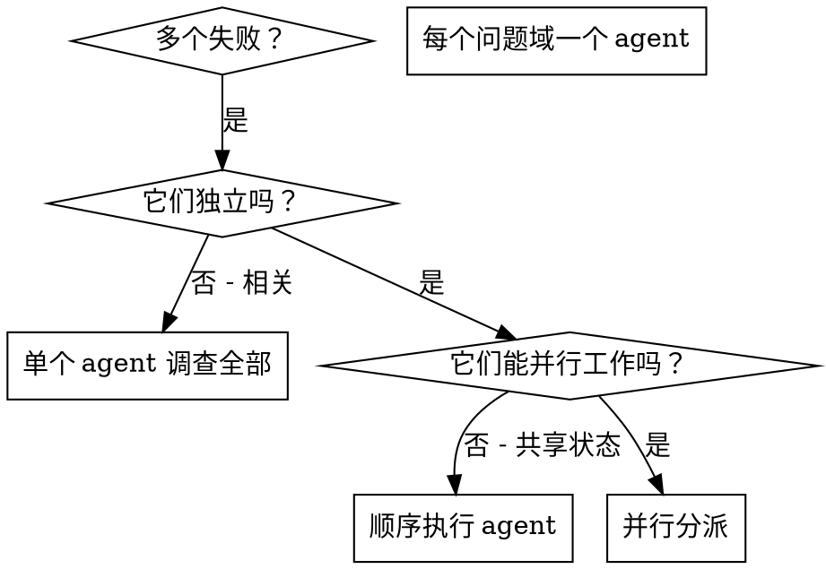

# Dispatching Parallel Agents

## 概述

你将任务委派给拥有隔离上下文的专用 agent。通过精心构造它们的指令和上下文，确保它们专注于任务并成功完成。它们不应继承你的会话上下文或历史——你需要精确构造它们所需的一切。这也能保留你自己的上下文用于协调工作。

当你遇到多个不相关的失败（不同的测试文件、不同的子系统、不同的 bug）时，逐个排查是浪费时间的。每个排查都是独立的，可以并行进行。

**核心原则：** 每个独立问题域分派一个 agent。让它们并发工作。

## 何时使用



**使用场景：**
- 3 个以上测试文件因不同根因失败
- 多个子系统独立损坏
- 每个问题无需其他问题的上下文即可理解
- 各调查之间无共享状态

**不适用场景：**
- 失败是相关的（修复一个可能修复其他的）
- 需要理解完整的系统状态
- Agent 之间会互相干扰

## 模式

### 1. 识别独立域

按故障分组：
- 文件 A 的测试：工具审批流程
- 文件 B 的测试：批处理完成行为
- 文件 C 的测试：中止功能

每个域是独立的——修复工具审批不会影响中止测试。

### 2. 创建聚焦的 Agent 任务

每个 agent 获得：
- **明确的范围：** 一个测试文件或子系统
- **清晰的目标：** 让这些测试通过
- **约束条件：** 不要修改其他代码
- **期望的输出：** 总结你发现了什么以及修复了什么

### 3. 并行分派

```typescript
// 在 Claude Code / AI 环境中
Task("修复 agent-tool-abort.test.ts 的失败")
Task("修复 batch-completion-behavior.test.ts 的失败")
Task("修复 tool-approval-race-conditions.test.ts 的失败")
// 三个同时运行
```

### 4. 审查与整合

当 agent 返回结果时：
- 阅读每份总结
- 验证修复之间没有冲突
- 运行完整测试套件
- 整合所有变更

## Agent Prompt 结构

好的 agent prompt 应该：
1. **聚焦** - 一个明确的问题域
2. **自包含** - 理解问题所需的所有上下文
3. **明确输出要求** - Agent 应该返回什么？

```markdown
修复 src/agents/agent-tool-abort.test.ts 中的 3 个失败测试：

1. "should abort tool with partial output capture" - 期望消息中包含 'interrupted at'
2. "should handle mixed completed and aborted tools" - 快速工具被中止而非完成
3. "should properly track pendingToolCount" - 期望 3 个结果但得到 0

这些是时序/竞态条件问题。你的任务：

1. 阅读测试文件，理解每个测试验证的内容
2. 找到根因——是时序问题还是实际的 bug？
3. 修复方式：
   - 用基于事件的等待替代任意超时
   - 如果发现中止实现中的 bug 则修复
   - 如果测试验证的是已变更的行为则调整期望值

不要只是增加超时——找到真正的问题。

返回：你发现了什么以及修复了什么的总结。
```

## 常见错误

**❌ 范围太广：** "修复所有测试" - agent 会迷失方向
**✅ 具体明确：** "修复 agent-tool-abort.test.ts" - 聚焦的范围

**❌ 无上下文：** "修复竞态条件" - agent 不知道在哪里
**✅ 有上下文：** 粘贴错误消息和测试名称

**❌ 无约束：** Agent 可能会重构所有东西
**✅ 有约束：** "不要修改生产代码" 或 "只修复测试"

**❌ 输出模糊：** "修好它" - 你不知道改了什么
**✅ 输出明确：** "返回根因和变更的总结"

## 不适用的场景

**相关失败：** 修复一个可能修复其他的——先一起调查
**需要全局上下文：** 理解问题需要看到整个系统
**探索性调试：** 你还不知道什么坏了
**共享状态：** Agent 之间会互相干扰（编辑相同文件、使用相同资源）

## 实际案例

**场景：** 大规模重构后 3 个文件中有 6 个测试失败

**失败情况：**
- agent-tool-abort.test.ts：3 个失败（时序问题）
- batch-completion-behavior.test.ts：2 个失败（工具未执行）
- tool-approval-race-conditions.test.ts：1 个失败（执行计数 = 0）

**决策：** 独立域——中止逻辑、批处理完成、竞态条件各自独立

**分派：**
```
Agent 1 → 修复 agent-tool-abort.test.ts
Agent 2 → 修复 batch-completion-behavior.test.ts
Agent 3 → 修复 tool-approval-race-conditions.test.ts
```

**结果：**
- Agent 1：用基于事件的等待替代了超时
- Agent 2：修复了事件结构 bug（threadId 位置错误）
- Agent 3：添加了对异步工具执行完成的等待

**整合：** 所有修复互相独立，无冲突，完整套件全绿

**节省的时间：** 3 个问题并行解决，而非顺序处理

## 核心优势

1. **并行化** - 多个调查同时进行
2. **聚焦** - 每个 agent 有狭窄的范围，需要跟踪的上下文更少
3. **独立性** - Agent 之间不互相干扰
4. **速度** - 3 个问题在 1 个问题的时间内解决

## 验证

Agent 返回后：
1. **审阅每份总结** - 理解改了什么
2. **检查冲突** - Agent 是否编辑了相同的代码？
3. **运行完整套件** - 验证所有修复能一起工作
4. **抽查** - Agent 可能犯系统性错误

## 实际效果

来自调试会话（2025-10-03）：
- 3 个文件中 6 个失败
- 3 个 agent 并行分派
- 所有调查并发完成
- 所有修复成功整合
- Agent 变更之间零冲突
