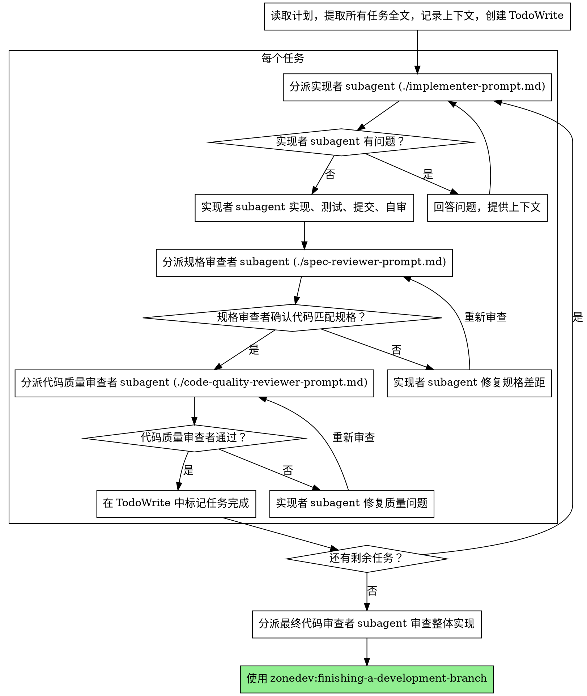

# Subagent-Driven Development

通过为每个任务分派一个全新的 subagent 来执行计划，每个任务完成后进行两阶段审查：先审查规格合规性，再审查代码质量。

**为什么使用 subagent：** 你将任务委派给拥有隔离上下文的专用 agent。通过精心构造它们的指令和上下文，确保它们专注于任务并成功完成。它们不应继承你的会话上下文或历史——你需要精确构造它们所需的一切。这也能保留你自己的上下文用于协调工作。

**核心原则：** 每个任务一个全新的 subagent + 两阶段审查（规格合规性 + 代码质量）= 高质量、快速迭代

**持续执行：** 不要在任务之间暂停去询问你的用户。从计划中提取所有任务后持续执行，不要停下来。唯一需要停止的情况是：无法解决的 BLOCKED 状态、真正阻碍进展的歧义、或者所有任务都已完成。"要继续吗？"这类提示和进度汇报只会浪费他们的时间——他们让你执行计划，那就执行下去。

## 何时使用

由 writing-plans 自动路由：3 个以上任务或涉及多文件协调的标准计划使用本 skill。≤2 个任务的小型计划直接在当前会话内联执行。

## 流程



## 模型选择

使用能胜任各角色的最低成本模型，以节约开支并提高速度。

**机械性实现任务**（独立函数、明确规格、1-2 个文件）：使用快速、低成本的模型。当计划定义良好时，大多数实现任务都是机械性的。

**集成与判断型任务**（多文件协调、模式匹配、调试）：使用标准模型。

**架构、设计与审查任务**：使用最强的可用模型。

**任务复杂度信号：**
- 涉及 1-2 个文件且有完整规格 → 低成本模型
- 涉及多个文件且有集成关注点 → 标准模型
- 需要设计判断或广泛的代码库理解 → 最强模型

## 处理实现者状态

实现者 subagent 会报告四种状态之一。按如下方式处理：

**DONE：** 进入规格合规性审查。

**DONE_WITH_CONCERNS：** 实现者完成了工作但标记了疑虑。在继续之前阅读这些疑虑。如果涉及正确性或范围问题，在审查前解决；如果只是观察性意见（如"这个文件越来越大了"），记录下来并继续审查。

**NEEDS_CONTEXT：** 实现者需要未提供的信息。提供缺失的上下文并重新分派。

**BLOCKED：** 实现者无法完成任务。评估阻塞原因：
1. 如果是上下文问题，提供更多上下文并使用同一模型重新分派
2. 如果任务需要更强的推理能力，使用更强的模型重新分派
3. 如果任务太大，拆分为更小的子任务
4. 如果计划本身有误，上报给用户

**绝不**忽略上报或在不做任何改变的情况下让同一模型重试。如果实现者说它被卡住了，就一定有需要改变的地方。

## Prompt 模板

- `./implementer-prompt.md` - 分派实现者 subagent
- `./spec-reviewer-prompt.md` - 分派规格合规性审查者 subagent
- `./code-quality-reviewer-prompt.md` - 分派代码质量审查者 subagent

## 示例工作流

```
你：我正在使用 Subagent-Driven Development 执行这个计划。

[读取计划文件：docs/zonedev/plans/feature-plan.md]
[提取全部 5 个任务的完整文本和上下文]
[创建 TodoWrite 包含所有任务]

任务 1：Hook 安装脚本

[获取任务 1 的文本和上下文（已提取）]
[分派实现 subagent，附带完整任务文本 + 上下文]

实现者："在我开始之前——hook 应该安装在用户级别还是系统级别？"

你："用户级别（~/.config/zonedev/hooks/）"

实现者："明白了。开始实现..."
[稍后] 实现者：
  - 实现了 install-hook 命令
  - 添加了测试，5/5 通过
  - 自审：发现遗漏了 --force 标志，已添加
  - 已提交

[分派规格合规性审查者]
规格审查者：✅ 符合规格 - 所有需求均已满足，无多余内容

[获取 git SHA，分派代码质量审查者]
代码审查者：优点：测试覆盖好，代码整洁。问题：无。通过。

[标记任务 1 完成]

任务 2：恢复模式

[获取任务 2 的文本和上下文（已提取）]
[分派实现 subagent，附带完整任务文本 + 上下文]

实现者：[无问题，直接开始]
实现者：
  - 添加了验证/修复模式
  - 8/8 测试通过
  - 自审：一切正常
  - 已提交

[分派规格合规性审查者]
规格审查者：❌ 问题：
  - 缺失：进度报告（规格要求"每 100 项报告一次"）
  - 多余：添加了 --json 标志（未被要求）

[实现者修复问题]
实现者：移除了 --json 标志，添加了进度报告

[规格审查者再次审查]
规格审查者：✅ 现在符合规格

[分派代码质量审查者]
代码审查者：优点：扎实。问题（重要）：魔法数字（100）

[实现者修复]
实现者：提取了 PROGRESS_INTERVAL 常量

[代码审查者再次审查]
代码审查者：✅ 通过

[标记任务 2 完成]

...

[所有任务完成后]
[分派最终代码审查者]
最终审查者：所有需求已满足，可以合并

完成！
```

## 优势

**效率提升：**
- 无文件读取开销（控制者提供全文）
- 控制者精确策划所需的上下文
- Subagent 预先获得完整信息
- 问题在工作开始前暴露（而非之后）

**质量关卡：**
- 自审在交接前捕获问题
- 两阶段审查：规格合规性，然后代码质量
- 审查循环确保修复确实有效
- 规格合规性审查防止过度或不足构建
- 代码质量审查确保实现质量

**成本：**
- 更多 subagent 调用（每个任务需要实现者 + 2 个审查者）
- 控制者需要做更多准备工作（预先提取所有任务）
- 审查循环增加迭代次数
- 但能尽早捕获问题（比后期调试更划算）

## 红线

**绝不：**
- 未经用户明确同意就在 main/master 分支上开始实现
- 跳过审查（规格合规性或代码质量）
- 在问题未修复的情况下继续推进
- 并行分派多个实现 subagent（会产生冲突）
- 让 subagent 自己读取计划文件（应提供全文）
- 跳过场景设定上下文（subagent 需要理解任务在整体中的位置）
- 忽略 subagent 的提问（在让它们继续之前先回答）
- 在规格合规性上接受"差不多就行"（规格审查者发现问题 = 未完成）
- 跳过审查循环（审查者发现问题 = 实现者修复 = 再次审查）
- 让实现者的自审取代正式审查（两者都需要）
- **在规格合规性通过之前开始代码质量审查**（顺序错误）
- 在任一审查有未解决问题时就进入下一个任务

**如果 subagent 提问：**
- 清晰完整地回答
- 必要时提供额外上下文
- 不要催促它们赶紧开始实现

**如果审查者发现问题：**
- 实现者（同一个 subagent）修复
- 审查者再次审查
- 重复直到通过
- 不要跳过重新审查

**如果 subagent 未能完成任务：**
- 分派修复 subagent 并附带具体指令
- 不要手动修复（上下文污染）

## 集成

**必需的工作流 skill：**
- **zonedev:using-git-worktrees** - 确保隔离的工作空间（创建或验证已有的）
- **zonedev:writing-plans** - 创建本 skill 所执行的计划
- **zonedev:requesting-code-review** - 审查者 subagent 使用的代码审查模板
- **zonedev:finishing-a-development-branch** - 所有任务完成后结束开发

**Subagent 应使用：**
- **zonedev:test-driven-development** - Subagent 在每个任务中遵循 TDD
