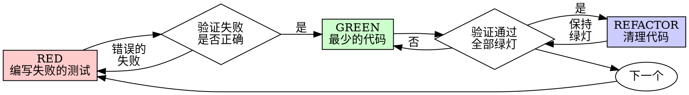

# 测试驱动开发（TDD）

## 概述

先写测试。看它失败。再写最少的代码让它通过。

**核心原则：** 如果你没有看到测试失败，你就无法确认它是否测试了正确的东西。

**违反规则的字面意思就是违反规则的精神。**

## 何时使用

**始终使用：**
- 新功能
- Bug 修复
- 重构
- 行为变更

**例外情况（需征得你的用户同意）：**
- 一次性原型
- 生成的代码
- 配置文件

想着"就这一次跳过 TDD"？停下来。那是在自我合理化。

## 铁律

```
没有失败的测试，就不写生产代码
```

先写了代码再补测试？删掉它。从头来过。

**没有例外：**
- 不要把它留作"参考"
- 不要在写测试时"改编"它
- 不要看它
- 删除就是删除

从测试出发，重新实现。就这样。

## Red-Green-Refactor



### RED - 编写失败的测试

编写一个最小的测试来说明预期行为。

<Good>
```typescript
test('retries failed operations 3 times', async () => {
  let attempts = 0;
  const operation = () => {
    attempts++;
    if (attempts < 3) throw new Error('fail');
    return 'success';
  };

  const result = await retryOperation(operation);

  expect(result).toBe('success');
  expect(attempts).toBe(3);
});
```
名称清晰，测试真实行为，只测一件事
</Good>

<Bad>
```typescript
test('retry works', async () => {
  const mock = jest.fn()
    .mockRejectedValueOnce(new Error())
    .mockRejectedValueOnce(new Error())
    .mockResolvedValueOnce('success');
  await retryOperation(mock);
  expect(mock).toHaveBeenCalledTimes(3);
});
```
名称模糊，测试的是 mock 而不是代码
</Bad>

**要求：**
- 只测一个行为
- 名称清晰
- 使用真实代码（除非不得已才用 mock）

### 验证 RED - 看它失败

**必须执行。绝不跳过。**

```bash
npm test path/to/test.test.ts
```

确认：
- 测试失败（不是报错）
- 失败信息符合预期
- 因功能缺失而失败（不是拼写错误）

**测试通过了？** 你在测试已有的行为。修改测试。

**测试报错了？** 修复错误，重新运行直到它正确地失败。

### GREEN - 最少的代码

编写最简单的代码来通过测试。

<Good>
```typescript
async function retryOperation<T>(fn: () => Promise<T>): Promise<T> {
  for (let i = 0; i < 3; i++) {
    try {
      return await fn();
    } catch (e) {
      if (i === 2) throw e;
    }
  }
  throw new Error('unreachable');
}
```
刚好够通过测试
</Good>

<Bad>
```typescript
async function retryOperation<T>(
  fn: () => Promise<T>,
  options?: {
    maxRetries?: number;
    backoff?: 'linear' | 'exponential';
    onRetry?: (attempt: number) => void;
  }
): Promise<T> {
  // YAGNI
}
```
过度设计
</Bad>

不要添加功能，不要重构其他代码，不要做超出测试要求的"改进"。

### 验证 GREEN - 看它通过

**必须执行。**

```bash
npm test path/to/test.test.ts
```

确认：
- 测试通过
- 其他测试仍然通过
- 输出干净（无错误、无警告）

**测试失败了？** 修改代码，不要改测试。

**其他测试失败了？** 立即修复。

### REFACTOR - 清理代码

仅在绿灯之后进行：
- 消除重复
- 改善命名
- 提取辅助函数

保持测试绿灯。不要添加新行为。

### 重复

为下一个功能编写下一个失败的测试。

## 好的测试

| 质量 | 好的做法 | 坏的做法 |
|---------|------|-----|
| **最小化** | 只测一件事。名称里有"和"？拆分它。 | `test('validates email and domain and whitespace')` |
| **清晰** | 名称描述行为 | `test('test1')` |
| **表达意图** | 展示期望的 API 用法 | 掩盖了代码应该做什么 |

## 为什么顺序很重要

**"我先写代码，之后再补测试来验证"**

先写代码再补的测试会直接通过。直接通过什么也证明不了：
- 可能测试了错误的东西
- 可能测试的是实现细节而非行为
- 可能遗漏了你忘记的边界情况
- 你从未看到它捕获过 bug

先写测试迫使你看到测试失败，证明它确实在测试某些东西。

**"我已经手动测试了所有的边界情况"**

手动测试是随意的。你以为测全了，但实际上：
- 没有测试记录
- 代码变更时无法重新运行
- 压力之下容易遗漏
- "我试过没问题" 不等于 全面测试

自动化测试是系统性的。每次运行方式完全一致。

**"删掉 X 小时的工作太浪费了"**

这是沉没成本谬误。时间已经花掉了。你现在的选择是：
- 删掉并用 TDD 重写（多花 X 小时，高置信度）
- 保留并事后补测试（30 分钟，低置信度，很可能有 bug）

真正的"浪费"是保留你无法信任的代码。没有真正测试的可运行代码就是技术债。

**"TDD 太教条了，务实的做法应该灵活变通"**

TDD 本身就是务实的：
- 在提交前发现 bug（比事后调试更快）
- 防止回归（测试立即捕获破坏）
- 记录行为（测试展示如何使用代码）
- 支持重构（放心修改，测试会捕获问题）

"务实的"捷径 = 在生产环境调试 = 更慢。

**"事后补测试也能达到同样的目的——重要的是精神而非形式"**

不对。事后补的测试回答的是"这段代码做了什么？"先写的测试回答的是"这段代码应该做什么？"

事后补的测试受你的实现影响。你测试的是你构建出来的东西，而不是需求要求的东西。你验证的是你记得住的边界情况，而不是你能发现的边界情况。

先写测试迫使你在实现之前就发现边界情况。事后补测试只能验证你是否记住了所有情况（你没有）。

30 分钟的事后补测试 不等于 TDD。你得到了覆盖率，但失去了测试有效的证明。

## 常见的自我合理化

| 借口 | 现实 |
|--------|---------|
| "太简单了不需要测试" | 简单的代码也会出 bug。测试只需 30 秒。 |
| "我之后再测" | 直接通过的测试什么也证明不了。 |
| "事后补测试也能达到同样目的" | 事后补测试 = "这做了什么？" 先写测试 = "这应该做什么？" |
| "已经手动测试过了" | 随意测试 不等于 系统测试。没有记录，无法重跑。 |
| "删掉 X 小时的工作太浪费了" | 沉没成本谬误。保留未验证的代码才是技术债。 |
| "留作参考，再用 TDD 重写" | 你会改编它。那就是事后补测试。删除就是删除。 |
| "需要先探索一下" | 可以。但探索完就丢掉，从 TDD 开始。 |
| "测试很难写 = 设计不清晰" | 听测试的声音。难测试 = 难使用。 |
| "TDD 会拖慢我" | TDD 比调试更快。务实 = 先写测试。 |
| "手动测试更快" | 手动测试无法证明边界情况。每次修改都得重测。 |
| "现有代码没有测试" | 你在改进它。为现有代码添加测试。 |

## 危险信号 - STOP 并从头来过

- 先写代码再补测试
- 实现之后才写测试
- 测试立即通过
- 无法解释为什么测试失败
- 测试"之后再加"
- 在合理化"就这一次"
- "我已经手动测试过了"
- "事后补测试也能达到同样的目的"
- "重要的是精神而非形式"
- "留作参考"或"改编现有代码"
- "已经花了 X 小时，删掉太浪费了"
- "TDD 太教条了，我更务实"
- "这次情况不一样因为……"

**以上所有情况都意味着：删掉代码。用 TDD 从头来过。**

## 示例：Bug 修复

**Bug：** 空邮箱被接受了

**RED**
```typescript
test('rejects empty email', async () => {
  const result = await submitForm({ email: '' });
  expect(result.error).toBe('Email required');
});
```

**验证 RED**
```bash
$ npm test
FAIL: expected 'Email required', got undefined
```

**GREEN**
```typescript
function submitForm(data: FormData) {
  if (!data.email?.trim()) {
    return { error: 'Email required' };
  }
  // ...
}
```

**验证 GREEN**
```bash
$ npm test
PASS
```

**REFACTOR**
如果需要的话，提取校验逻辑以支持多个字段。

## 验证清单

在标记工作完成之前：

- [ ] 每个新函数/方法都有测试
- [ ] 在实现之前看到每个测试失败
- [ ] 每个测试因预期原因失败（功能缺失，而非拼写错误）
- [ ] 为每个测试编写了最少的代码使其通过
- [ ] 所有测试通过
- [ ] 输出干净（无错误、无警告）
- [ ] 测试使用真实代码（仅在不得已时使用 mock）
- [ ] 覆盖了边界情况和错误情况

无法勾选所有项？你跳过了 TDD。从头来过。

## 遇到困难时

| 问题 | 解决方案 |
|---------|----------|
| 不知道怎么测试 | 写出你期望的 API。先写断言。问你的用户。 |
| 测试太复杂 | 设计太复杂了。简化接口。 |
| 必须 mock 所有东西 | 代码耦合太紧。使用依赖注入。 |
| 测试 setup 太庞大 | 提取辅助函数。还是复杂？简化设计。 |

## 调试集成

发现 bug 了？写一个能复现它的失败测试。按 TDD 循环走。测试既能证明修复有效，又能防止回归。

永远不要在没有测试的情况下修复 bug。

## 测试反模式

在添加 mock 或测试工具时，阅读 @testing-anti-patterns.md 以避免常见陷阱：
- 测试的是 mock 行为而非真实行为
- 在生产类中添加仅供测试使用的方法
- 在不理解依赖关系的情况下使用 mock

## 终极规则

```
生产代码 → 必须有先失败的测试存在
否则 → 不是 TDD
```

没有你的用户的许可，不允许例外。
