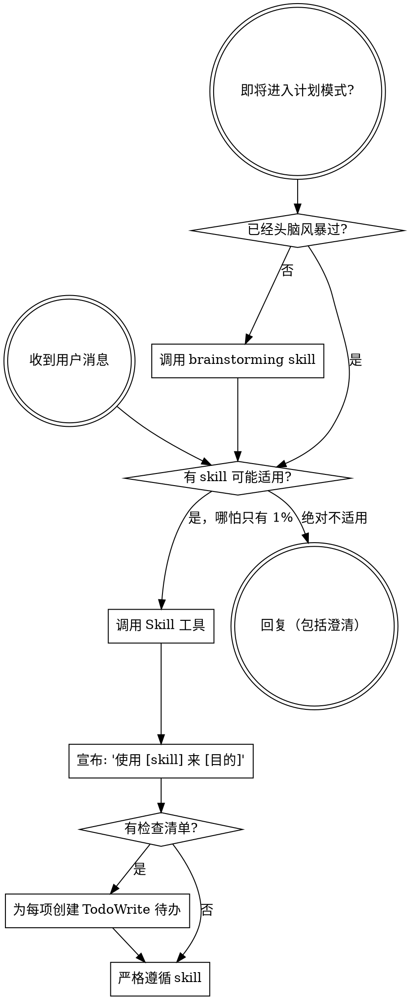

<SUBAGENT-STOP>
如果你是作为 subagent 被派发来执行特定任务的，跳过此 skill。
</SUBAGENT-STOP>

<EXTREMELY-IMPORTANT>
如果你认为哪怕只有 1% 的可能性某个 skill 适用于你正在做的事，你就绝对必须调用它。

如果有 SKILL 适用于你的任务，你没有选择。你必须使用它。

这不可协商。这不是可选的。你不能给自己找理由绕过这一点。
</EXTREMELY-IMPORTANT>

## 指令优先级

Superpowers skill 会覆盖默认系统提示的行为，但**用户指令始终具有最高优先级**：

1. **用户的明确指令**（CLAUDE.md、GEMINI.md、AGENTS.md、直接请求）——最高优先级
2. **Superpowers skill**——在冲突处覆盖默认系统行为
3. **默认系统提示**——最低优先级

如果 CLAUDE.md、GEMINI.md 或 AGENTS.md 说"不要使用 TDD"，而某个 skill 说"始终使用 TDD"，则遵循用户的指令。用户拥有控制权。

## 如何访问 Skill

**在 Claude Code 中：** 使用 `Skill` 工具。调用 skill 时，其内容会被加载并呈现给你——直接遵循即可。永远不要使用 Read 工具读取 skill 文件。

**在 Copilot CLI 中：** 使用 `skill` 工具。Skill 会从已安装的插件中自动发现。`skill` 工具的工作方式与 Claude Code 的 `Skill` 工具相同。

**在 Gemini CLI 中：** Skill 通过 `activate_skill` 工具激活。Gemini 在会话启动时加载 skill 元数据，并按需激活完整内容。

**在其他环境中：** 查阅你所用平台的文档，了解 skill 的加载方式。

## 平台适配

Skill 使用 Claude Code 的工具名称。非 CC 平台：参见 `references/copilot-tools.md`（Copilot CLI）、`references/codex-tools.md`（Codex）了解工具对应关系。Gemini CLI 用户通过 GEMINI.md 自动加载工具映射。

# 使用 Skill

## 规则

**在任何回复或行动之前，先调用相关或被请求的 skill。** 哪怕只有 1% 的可能性某个 skill 适用，你也应该调用它来检查。如果调用后发现该 skill 不适用于当前情况，你不需要使用它。

## 危险信号

以下想法意味着"停下"——你在给自己找理由：

| 想法 | 现实 |
|------|------|
| "这只是个简单问题" | 问题就是任务。检查 skill。 |
| "我需要先了解更多背景" | Skill 检查在澄清性问题之前。 |
| "让我先浏览一下代码库" | Skill 告诉你如何浏览。先检查。 |
| "我可以快速查一下 git/文件" | 文件缺少对话上下文。检查 skill。 |
| "让我先收集信息" | Skill 告诉你如何收集信息。 |
| "这不需要正式的 skill" | 如果 skill 存在，就使用它。 |
| "我记得这个 skill" | Skill 会更新。读当前版本。 |
| "这不算一个任务" | 行动 = 任务。检查 skill。 |
| "这个 skill 太小题大做了" | 简单的事会变复杂。使用它。 |
| "我先做这一件事" | 做任何事之前先检查。 |
| "这感觉很高效" | 没有纪律的行动浪费时间。Skill 可以防止这一点。 |
| "我知道那是什么意思" | 知道概念 ≠ 使用 skill。调用它。 |

## Skill 优先级

当多个 skill 可能适用时，使用以下顺序：

1. **先用过程性 skill**（brainstorming、debugging）——它们决定如何切入任务
2. **再用实现性 skill**（frontend-design、mcp-builder）——它们指导具体执行

"来构建 X"→ 先 brainstorming，再用实现性 skill。
"修复这个 bug"→ 先 debugging，再用领域特定的 skill。

## Skill 类型

**刚性**（TDD、debugging）：严格遵循。不要因"灵活"而放弃纪律。

**柔性**（模式类）：根据上下文调整原则。

Skill 本身会告诉你它属于哪种。

## 用户指令

指令说的是做什么，而不是怎么做。"添加 X"或"修复 Y"不意味着跳过工作流。
