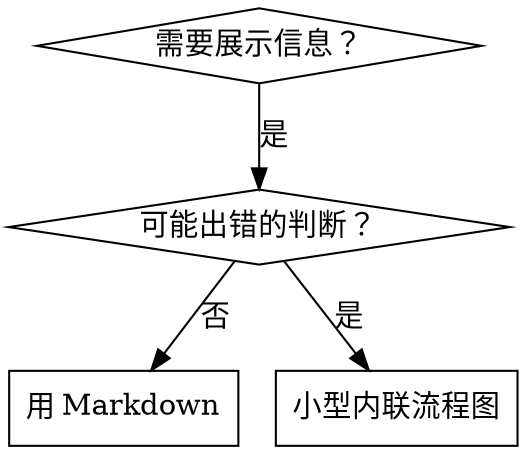

# 编写 Skill

## 概述

**编写 skill 就是将测试驱动开发应用于流程文档。**

**个人 skill 存放在 agent 特定的目录中（Claude Code 用 `~/.claude/skills`，Codex 用 `~/.agents/skills/`）**

你编写测试用例（使用 subagent 的压力场景），看着它们失败（基线行为），编写 skill（文档），看着测试通过（agent 遵守），然后重构（堵住漏洞）。

**核心原则：** 如果你没有看到 agent 在没有 skill 的情况下失败，你就不知道 skill 教的是不是正确的东西。

**必要前置知识：** 在使用此 skill 之前，你**必须**理解 zonedev:test-driven-development。那个 skill 定义了基本的 RED-GREEN-REFACTOR 循环。此 skill 将 TDD 适配到文档编写中。

**官方指导：** 关于 Anthropic 官方的 skill 编写最佳实践，参见 anthropic-best-practices.md。该文档提供了与本 skill 的 TDD 方法互补的额外模式和指南。

## 什么是 Skill？

**Skill** 是经过验证的技术、模式或工具的参考指南。Skill 帮助未来的 Claude 实例找到并应用有效的方法。

**Skill 是：** 可复用的技术、模式、工具、参考指南

**Skill 不是：** 关于你某次如何解决问题的叙事

## TDD 到 Skill 的映射

| TDD 概念 | Skill 创建 |
|-------------|----------------|
| **测试用例** | 使用 subagent 的压力场景 |
| **生产代码** | Skill 文档 (SKILL.md) |
| **测试失败 (RED)** | Agent 在没有 skill 时违反规则（基线） |
| **测试通过 (GREEN)** | Agent 在有 skill 时遵守规则 |
| **重构** | 堵住漏洞，同时保持合规 |
| **先写测试** | 在编写 skill 之前运行基线场景 |
| **看着它失败** | 记录 agent 使用的确切合理化借口 |
| **最少代码** | 编写针对这些具体违规行为的 skill |
| **看着它通过** | 验证 agent 现在遵守规则 |
| **重构循环** | 发现新的合理化借口 → 堵住 → 重新验证 |

整个 skill 创建过程遵循 RED-GREEN-REFACTOR。

## 何时创建 Skill

**应该创建的场景：**
- 技术对你来说不是直觉上显而易见的
- 你会在不同项目中反复引用它
- 模式具有广泛适用性（非项目特定）
- 其他人也会从中受益

**不应创建的场景：**
- 一次性方案
- 其他地方已有良好文档的标准实践
- 项目特定的约定（放到 CLAUDE.md 中）
- 机械性约束（如果可以用正则/验证来强制执行，就自动化它——把文档留给需要判断力的场景）

## Skill 类型

### 技术（Technique）
有具体步骤的方法（condition-based-waiting、root-cause-tracing）

### 模式（Pattern）
思考问题的方式（flatten-with-flags、test-invariants）

### 参考（Reference）
API 文档、语法指南、工具文档（office docs）

## 目录结构

```
skills/
  skill-name/
    SKILL.md              # 主参考文件（必需）
    supporting-file.*     # 仅在需要时
```

**扁平命名空间** —— 所有 skill 在一个可搜索的命名空间中

**需要独立文件的情况：**
1. **大量参考内容**（100+ 行）—— API 文档、完整语法
2. **可复用工具** —— 脚本、工具、模板

**保持内联的情况：**
- 原则和概念
- 代码模式（< 50 行）
- 其他所有内容

## SKILL.md 结构

**Frontmatter（YAML）：**
- 两个必填字段：`name` 和 `description`（参见 [agentskills.io/specification](https://agentskills.io/specification) 了解所有支持的字段）
- 总计最多 1024 个字符
- `name`：仅使用字母、数字和连字符（不使用括号、特殊字符）
- `description`：第三人称，**仅**描述何时使用（**不是**它做什么）
  - 以 "Use when..." 开头（中文 skill 可用"当...时使用"），聚焦于触发条件
  - 包含具体的症状、情境和上下文
  - **永远不要概括 skill 的流程或工作流**（原因见 CSO 部分）
  - 尽可能保持在 500 字符以内

```markdown
---
name: Skill-Name-With-Hyphens
description: Use when [specific triggering conditions and symptoms]
---

# Skill 名称

## 概述
这是什么？用 1-2 句话阐明核心原则。

## 何时使用
[如果判断不直观，可放一个小型内联流程图]

带有症状和用例的要点列表
何时不应使用

## 核心模式（用于技术/模式类 skill）
前后对比代码

## 快速参考
便于扫描常见操作的表格或要点

## 实现
简单模式用内联代码
大量参考内容或可复用工具则链接到文件

## 常见错误
哪里容易出错 + 修复方法

## 实际效果（可选）
具体成果
```


## Claude 搜索优化（CSO）

**对发现性至关重要：** 未来的 Claude 需要能**找到**你的 skill

### 1. 丰富的 Description 字段

**用途：** Claude 读取 description 来决定为给定任务加载哪些 skill。让它能回答："我现在应该读这个 skill 吗？"

**格式：** 以 "Use when..." 开头，聚焦于触发条件

**关键：Description = 何时使用，不是 Skill 做什么**

Description 应该**仅仅**描述触发条件。不要在 description 中概括 skill 的流程或工作流。

**为什么这很重要：** 测试发现，当 description 概括了 skill 的工作流时，Claude 可能会遵循 description 而不是阅读完整的 skill 内容。一个说"任务之间进行代码审查"的 description 导致 Claude 只做了一次审查，即使 skill 的流程图清楚地展示了两次审查（规格合规性检查和代码质量检查）。

当 description 改为仅说"当在当前会话中执行包含独立任务的实施计划时使用"（没有工作流概括）后，Claude 正确地阅读了流程图并遵循了两阶段审查流程。

**陷阱：** 概括工作流的 description 创建了一条 Claude 会走的捷径。Skill 正文变成了 Claude 跳过的文档。

```yaml
# 错误：概括了工作流——Claude 可能遵循这个而不是读 skill
description: Use when executing plans - dispatches subagent per task with code review between tasks

# 错误：太多流程细节
description: Use for TDD - write test first, watch it fail, write minimal code, refactor

# 正确：仅触发条件，没有工作流概括
description: Use when executing implementation plans with independent tasks in the current session

# 正确：仅触发条件
description: Use when implementing any feature or bugfix, before writing implementation code
```

**内容：**
- 使用具体的触发器、症状和信号来表明此 skill 适用
- 描述*问题*（竞态条件、不一致的行为）而非*语言特定的症状*（setTimeout、sleep）
- 保持触发器技术无关，除非 skill 本身是技术特定的
- 如果 skill 是技术特定的，在触发器中明确说明
- 第三人称书写（注入到系统提示中）
- **永远不要概括 skill 的流程或工作流**

```yaml
# 错误：太抽象、模糊，没有包含何时使用
description: For async testing

# 错误：第一人称
description: I can help you with async tests when they're flaky

# 错误：提到了技术，但 skill 并不特定于该技术
description: Use when tests use setTimeout/sleep and are flaky

# 正确：以 "Use when" 开头，描述问题，没有工作流
description: Use when tests have race conditions, timing dependencies, or pass/fail inconsistently

# 正确：技术特定的 skill，触发器明确
description: Use when using React Router and handling authentication redirects
```

### 2. 关键词覆盖

使用 Claude 会搜索的词汇：
- 错误消息："Hook timed out"、"ENOTEMPTY"、"race condition"
- 症状："flaky"、"hanging"、"zombie"、"pollution"
- 同义词："timeout/hang/freeze"、"cleanup/teardown/afterEach"
- 工具：实际命令名、库名、文件类型

### 3. 描述性命名

**使用主动语态，动词优先：**
- `creating-skills` 优于 `skill-creation`
- `condition-based-waiting` 优于 `async-test-helpers`

### 4. Token 效率（关键）

**问题：** getting-started 和常被引用的 skill 会加载到**每一次**对话中。每个 token 都很重要。

**目标字数：**
- getting-started 工作流：每个 < 150 词
- 频繁加载的 skill：总计 < 200 词
- 其他 skill：< 500 词（仍需简洁）

**技巧：**

**将细节移到工具帮助中：**
```bash
# 错误：在 SKILL.md 中记录所有参数
search-conversations supports --text, --both, --after DATE, --before DATE, --limit N

# 正确：引用 --help
search-conversations supports multiple modes and filters. Run --help for details.
```

**使用交叉引用：**
```markdown
# 错误：重复工作流细节
When searching, dispatch subagent with template...
[20 行重复的说明]

# 正确：引用其他 skill
Always use subagents (50-100x context savings). REQUIRED: Use [other-skill-name] for workflow.
```

**压缩示例：**
```markdown
# 错误：冗长的示例（42 词）
你的用户: "我们之前在 React Router 中如何处理认证错误的？"
你: 我会搜索过去的对话来寻找 React Router 认证模式。
[派遣 subagent，搜索查询："React Router authentication error handling 401"]

# 正确：最小化示例（20 词）
用户："我们之前如何处理 React Router 中的认证错误？"
你：正在搜索...
[派遣 subagent → 综合]
```

**消除冗余：**
- 不要重复交叉引用 skill 中已有的内容
- 不要解释从命令本身就能看出的东西
- 不要包含同一模式的多个示例

**验证：**
```bash
wc -w skills/path/SKILL.md
# getting-started 工作流：目标每个 < 150
# 其他频繁加载的：目标总计 < 200
```

**按你做的事情或核心洞见命名：**
- `condition-based-waiting` 优于 `async-test-helpers`
- `using-skills` 而非 `skill-usage`
- `flatten-with-flags` 优于 `data-structure-refactoring`
- `root-cause-tracing` 优于 `debugging-techniques`

**动名词（-ing）适用于过程：**
- `creating-skills`、`testing-skills`、`debugging-with-logs`
- 主动、描述你正在做的事情

### 4. 交叉引用其他 Skill

**当编写引用其他 skill 的文档时：**

仅使用 skill 名称，配合明确的需求标记：
- 正确：`**必须使用的子 SKILL：** 使用 zonedev:test-driven-development`
- 正确：`**必要前置知识：** 你必须理解 zonedev:systematic-debugging`
- 错误：`See skills/testing/test-driven-development`（不清楚是否必须）
- 错误：`@skills/testing/test-driven-development/SKILL.md`（强制加载，消耗上下文）

**为什么不用 @ 链接：** `@` 语法会立即强制加载文件，在你需要之前就消耗 200k+ 上下文。

## 流程图使用



**仅在以下场景使用流程图：**
- 不直观的决策点
- 可能过早停止的流程循环
- "何时用 A vs B"的决策

**永远不要在以下场景使用流程图：**
- 参考资料 → 表格、列表
- 代码示例 → Markdown 代码块
- 线性指令 → 有序列表
- 没有语义含义的标签（step1、helper2）

参见 @graphviz-conventions.dot 了解 graphviz 样式规则。

**为你的用户可视化：** 使用本目录中的 `render-graphs.js` 将 skill 的流程图渲染为 SVG：
```bash
./render-graphs.js ../some-skill           # 每个图单独渲染
./render-graphs.js ../some-skill --combine # 所有图合并为一个 SVG
```

## 代码示例

**一个优秀的示例胜过多个平庸的示例**

选择最相关的语言：
- 测试技术 → TypeScript/JavaScript
- 系统调试 → Shell/Python
- 数据处理 → Python

**好的示例：**
- 完整可运行
- 注释解释为什么（而非做什么）
- 来自真实场景
- 清晰展示模式
- 可直接适配（不是通用模板）

**不要：**
- 用 5 种以上语言实现
- 创建填空模板
- 编写虚构的示例

你擅长移植——一个优秀的示例就够了。

## 文件组织

### 自包含 Skill
```
defense-in-depth/
  SKILL.md    # 所有内容内联
```
适用于：所有内容都能放下，不需要大量参考

### 带可复用工具的 Skill
```
condition-based-waiting/
  SKILL.md    # 概述 + 模式
  example.ts  # 可适配的工作代码
```
适用于：工具是可复用的代码，而非叙事

### 带大量参考的 Skill
```
pptx/
  SKILL.md       # 概述 + 工作流
  pptxgenjs.md   # 600 行 API 参考
  ooxml.md       # 500 行 XML 结构
  scripts/       # 可执行工具
```
适用于：参考资料太大无法内联

## 铁律（与 TDD 相同）

```
没有先写失败测试，就没有 SKILL
```

这适用于新 skill 和对现有 skill 的编辑。

先写 skill 再测试？删掉。从头来过。
不测试就编辑 skill？同样违规。

**没有例外：**
- 不适用于"简单的添加"
- 不适用于"只是加个章节"
- 不适用于"文档更新"
- 不要把未经测试的改动保留为"参考"
- 不要在运行测试时"顺手调整"
- 删除就是删除

**必要前置知识：** zonedev:test-driven-development skill 解释了为什么这很重要。相同原则适用于文档。

## 测试所有 Skill 类型

不同类型的 skill 需要不同的测试方法：

### 纪律执行类 Skill（规则/要求）

**示例：** TDD、verification-before-completion、designing-before-coding

**测试方法：**
- 学术性问题：他们理解规则吗？
- 压力场景：他们在压力下遵守吗？
- 多种压力叠加：时间 + 沉没成本 + 疲劳
- 识别合理化借口并添加明确的反制

**成功标准：** Agent 在最大压力下仍遵守规则

### 技术类 Skill（操作指南）

**示例：** condition-based-waiting、root-cause-tracing、defensive-programming

**测试方法：**
- 应用场景：他们能正确应用技术吗？
- 变体场景：他们能处理边界情况吗？
- 信息缺失测试：说明是否有遗漏？

**成功标准：** Agent 能成功将技术应用到新场景

### 模式类 Skill（心智模型）

**示例：** reducing-complexity、information-hiding 概念

**测试方法：**
- 识别场景：他们能识别何时应用模式吗？
- 应用场景：他们能使用心智模型吗？
- 反例：他们知道何时**不**应用吗？

**成功标准：** Agent 能正确识别何时/如何应用模式

### 参考类 Skill（文档/API）

**示例：** API 文档、命令参考、库指南

**测试方法：**
- 检索场景：他们能找到正确的信息吗？
- 应用场景：他们能正确使用找到的信息吗？
- 缺口测试：常见用例是否都覆盖了？

**成功标准：** Agent 能找到并正确应用参考信息

## 跳过测试的常见借口

| 借口 | 现实 |
|--------|---------|
| "Skill 显然很清楚" | 对你清楚 ≠ 对其他 agent 清楚。测试它。 |
| "只是个参考" | 参考可能有遗漏、不清楚的部分。测试检索。 |
| "测试太小题大做" | 未经测试的 skill 总有问题。花 15 分钟测试省下数小时。 |
| "有问题再测" | 出问题 = agent 无法使用 skill。部署**前**测试。 |
| "测试太繁琐" | 测试没有在生产中调试坏 skill 繁琐。 |
| "我很有信心它没问题" | 过度自信保证出问题。还是测试吧。 |
| "学术审查就够了" | 阅读 ≠ 使用。测试应用场景。 |
| "没时间测试" | 部署未经测试的 skill 后面修复花的时间更多。 |

**所有这些都意味着：部署前测试。没有例外。**

## 防止 Skill 被合理化绕过

执行纪律的 skill（如 TDD）需要抵抗合理化。Agent 很聪明，在压力下会找漏洞。

**心理学注释：** 理解说服技术为什么有效能帮助你系统地应用它们。参见 persuasion-principles.md 了解研究基础（Cialdini, 2021; Meincke et al., 2025）关于权威、承诺、稀缺性、社会认同和统一性原则。

### 明确封堵每一个漏洞

不要只陈述规则——禁止具体的变通：

<Bad>
```markdown
先写代码再写测试？删掉。
```
</Bad>

<Good>
```markdown
先写代码再写测试？删掉。从头来过。

**没有例外：**
- 不要保留它作为"参考"
- 不要在写测试时"顺手调整"它
- 不要看它
- 删除就是删除
```
</Good>

### 应对"精神 vs 字面"的争论

在文档早期添加基本原则：

```markdown
**违反规则的字面含义就是违反规则的精神。**
```

这一条切断了整类"我遵循的是精神"的合理化借口。

### 构建合理化借口表

从基线测试中捕获合理化借口（参见下方测试部分）。Agent 使用的每个借口都放入表中：

```markdown
| 借口 | 现实 |
|--------|---------|
| "太简单不需要测试" | 简单代码也会出错。测试只需 30 秒。 |
| "我后面再测" | 测试立即通过什么也证明不了。 |
| "先实现后测试效果一样" | 后写测试 = "这段代码做了什么？" 先写测试 = "这段代码应该做什么？" |
```

### 创建危险信号列表

让 agent 容易自检是否在合理化：

```markdown
## 危险信号——停下来，从头开始

- 在测试之前写了代码
- "我已经手动测试过了"
- "先实现后测试效果一样"
- "重要的是精神不是仪式"
- "这个情况不同因为..."

**以上所有都意味着：删除代码。从 TDD 重新开始。**
```

### 更新 CSO 以涵盖违规症状

在 description 中添加：你即将违反规则时的症状：

```yaml
description: use when implementing any feature or bugfix, before writing implementation code
```

## Skill 的 RED-GREEN-REFACTOR

遵循 TDD 循环：

### RED：编写失败的测试（基线）

在**没有** skill 的情况下用 subagent 运行压力场景。记录确切的行为：
- 他们做了什么选择？
- 他们使用了什么合理化借口（逐字记录）？
- 哪些压力触发了违规？

这就是"看着测试失败"——你必须在编写 skill 之前看到 agent 自然会怎么做。

### GREEN：编写最少量的 Skill

编写针对那些具体合理化借口的 skill。不要为假想情况添加额外内容。

用 skill 运行相同场景。Agent 现在应该遵守。

### REFACTOR：堵住漏洞

Agent 找到了新的合理化借口？添加明确的反制。重新测试直到无懈可击。

**测试方法论：** 参见 @testing-skills-with-subagents.md 了解完整的测试方法论：
- 如何编写压力场景
- 压力类型（时间、沉没成本、权威、疲劳）
- 系统性地堵住漏洞
- 元测试技术

## 反模式

### 错误：叙事式示例
"在 2025-10-03 的会话中，我们发现空的 projectDir 导致了..."
**问题：** 太具体，不可复用

### 错误：多语言稀释
example-js.js、example-py.py、example-go.go
**问题：** 质量平庸，维护负担重

### 错误：在流程图中放代码
```dot
step1 [label="import fs"];
step2 [label="read file"];
```
**问题：** 无法复制粘贴，难以阅读

### 错误：通用标签
helper1、helper2、step3、pattern4
**问题：** 标签应该有语义含义

## 停下来：在转向下一个 Skill 之前

**编写完任何 skill 后，你必须停下来完成部署流程。**

**不要：**
- 批量创建多个 skill 而不逐个测试
- 在当前 skill 验证通过之前转向下一个
- 因为"批量更高效"而跳过测试

**以下部署检查清单对每一个 skill 都是强制性的。**

部署未经测试的 skill = 部署未经测试的代码。这违反了质量标准。

## Skill 创建检查清单（TDD 适配版）

**重要：使用 TodoWrite 为以下检查清单中的每一项创建待办事项。**

**RED 阶段——编写失败的测试：**
- [ ] 创建压力场景（纪律类 skill 需要 3 种以上叠加压力）
- [ ] 在**没有** skill 的情况下运行场景——逐字记录基线行为
- [ ] 识别合理化借口/失败中的模式

**GREEN 阶段——编写最少量的 Skill：**
- [ ] 名称仅使用字母、数字、连字符（不使用括号/特殊字符）
- [ ] YAML frontmatter 包含必填的 `name` 和 `description` 字段（最多 1024 字符；参见 [spec](https://agentskills.io/specification)）
- [ ] Description 以 "Use when..." 开头，包含具体的触发器/症状
- [ ] Description 用第三人称书写
- [ ] 全文包含搜索关键词（错误、症状、工具）
- [ ] 清晰的概述和核心原则
- [ ] 针对 RED 阶段识别出的具体基线失败
- [ ] 代码内联或链接到独立文件
- [ ] 一个优秀的示例（不要多语言）
- [ ] 用 skill 运行场景——验证 agent 现在遵守

**REFACTOR 阶段——堵住漏洞：**
- [ ] 从测试中识别新的合理化借口
- [ ] 添加明确的反制（如果是纪律类 skill）
- [ ] 从所有测试迭代中构建合理化借口表
- [ ] 创建危险信号列表
- [ ] 重新测试直到无懈可击

**质量检查：**
- [ ] 仅在判断不直观时使用小流程图
- [ ] 快速参考表
- [ ] 常见错误章节
- [ ] 没有叙事性讲故事
- [ ] 仅在工具或大量参考时使用独立文件

**部署：**
- [ ] 提交 skill 到 git 并推送到你的 fork（如已配置）
- [ ] 考虑通过 PR 回馈（如果有广泛的实用性）

## 发现工作流

未来的 Claude 如何找到你的 skill：

1. **遇到问题**（"测试不稳定"）
3. **找到 SKILL**（description 匹配）
4. **扫描概述**（这个相关吗？）
5. **阅读模式**（快速参考表）
6. **加载示例**（仅在实现时）

**为此流程优化** —— 把可搜索的词汇放在前面，反复出现。

## 总结

**创建 skill 就是将 TDD 应用于流程文档。**

相同的铁律：没有先写失败测试，就没有 skill。
相同的循环：RED（基线）→ GREEN（编写 skill）→ REFACTOR（堵住漏洞）。
相同的收益：更高的质量，更少的意外，无懈可击的成果。

如果你对代码遵循 TDD，就对 skill 也遵循 TDD。这是相同的纪律应用于文档。
